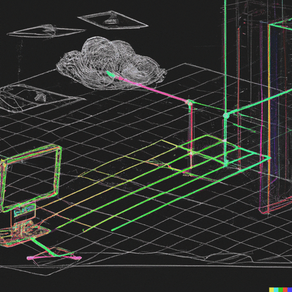

# 👋 Hello World, I'm Sebastian

<p align="center">

</p>


---

## 🚀 About Me

<table border="0" cellspacing="0" cellpadding="0">
  <tr>
    <td width="280" style="border:none">
      
    </td>
    <td width="30" style="border:none"></td>
    <td valign="top" style="border:none">
      <p>👨‍💻 <strong>Full Stack Developer</strong> building scalable, high-performance and secure web apps.</p>
      <p>🌐 Expertise in modern web technologies, cybersecurity and system design focused on efficient solutions.</p>
      <p>🤖 Deepening knowledge in <strong>Data Science, AI and Machine Learning</strong> to build smarter systems.</p>
      <p>🛡️ Passionate about <strong>Cybersecurity</strong>, ethical hacking and secure-by-design systems.</p>
      <p>🚀 Always exploring new tech, contributing to open source and pushing software engineering limits.</p>
      <p>📍 Based in <strong>Ecuador</strong>, open to remote opportunities worldwide.</p>
    </td>
  </tr>
</table>


```javascript
const sebastian = {
  identity: {
    name: "Sebastian Zhunaula",
    specialization: "Scalable Web Systems, Cybersecurity & AI",
    location: "Ecuador"
  },

  stack: {
    languages: ["JS", "TS", "Python", "Go"],
    frontend: ["React", "Next.js", "Angular", "Astro", "Tailwind"],
    backend: ["Node.js", "Express", "Laravel", "FastAPI"],
    databases: ["PostgreSQL", "MySQL", "MongoDB", "Redis"],
    devOps: ["Docker", "AWS", "Jenkins", "Linux", "Git"],
    security: ["Pentesting", "Web Security", "Kali"],
    ai: ["Pandas", "Machine Learning", "Neural Networks"]
  },

  focus: ["Scalable Systems", "Cybersecurity", "AI"],

  portfolio: "devsebastian44.vercel.app"
};
```

## 🎯 What I'm Up To

| 💻 Programming & Development | 🔒 Cybersecurity | 🧠 Data Science & AI |
|------------------------------|------------------|----------------------|
| 🌱 Building scalable web applications | 🛡️ Ethical Hacking & Pentesting | 📊 Learning Data Analysis & Visualization |
| 🚀 Exploring modern frameworks & tools | 🔍 Vulnerability Analysis | 🤖 Exploring Machine Learning Algorithms |
| 🎨 Creating beautiful user interfaces | 🕵️ Malware Research | 🧬 Studying Neural Networks & Deep Learning |
| ⚡ Optimizing performance & architecture | 🔐 Web Application Security | 📈 Working with Pandas, Matplotlib, and Seaborn |

---

## 🛠️ Tech Stack

<p align="center">
  
</p>

---

## ⭐ Github Stats

<p align="center">
  
  
</p>


<!--
---

<!--

## 🚀 Featured Projects

[](https://github.com/Devsebastian44/FakeAP)
[](https://github.com/Devsebastian44/Sandboxed)

-->

---


## 📫 Let's Connect

Interested in collaborating or have a project in mind? Let's build something amazing together!

[](https://devsebastian44.vercel.app/)
[](https://www.linkedin.com/in/devsebastian44/)