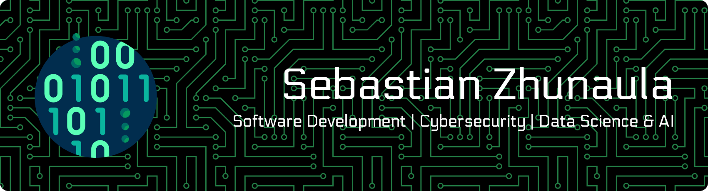
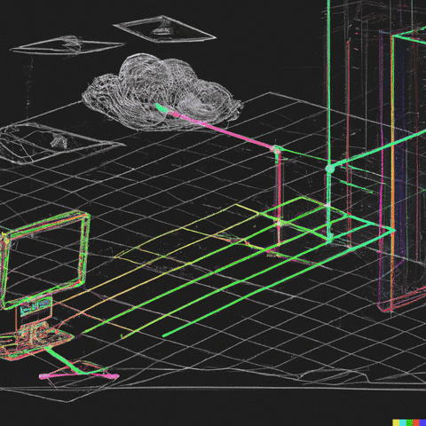

# 👋 Hola, soy Sebastian

<p align="center">

</p>

<p align="right"><a href="./README-EN.md">🇬🇧 English version</a></p>

## 🚀 Sobre mí

👨‍💻 Soy **desarrollador de software full stack** y me especializo en crear aplicaciones web escalables, seguras y de alto rendimiento. Mi experiencia abarca tecnologías web modernas, **ciberseguridad** 🛡️ y diseño de sistemas, con un enfoque en crear soluciones eficientes y confiables.

🤖 Actualmente, estoy profundizando mis conocimientos en **ciencia de datos**, **inteligencia artificial** y **aprendizaje automático**, e integrando estas disciplinas para desarrollar sistemas más inteligentes y robustos 🚀.

<p align="center">

</p>

```javascript
const sebastian = {
  identity: {
    name: "Sebastian Zhunaula",
    specialization: "Scalable Web Systems, Cybersecurity & AI",
    location: "Ecuador"
  },

  stack: {
    languages: ["JS", "TS", "Python", "Go"],
    frontend: ["React", "Next.js", "Angular", "Astro", "Tailwind"],
    backend: ["Node.js", "Express", "Laravel", "FastAPI"],
    databases: ["PostgreSQL", "MySQL", "MongoDB", "Redis"],
    devOps: ["Docker", "AWS", "Jenkins", "Linux", "Git"],
    security: ["Pentesting", "Web Security", "Kali"],
    ai: ["Pandas", "Machine Learning", "Neural Networks"]
  },

  focus: ["Scalable Systems", "Cybersecurity", "AI"],

  portfolio: "devsebastian44.vercel.app"
};
```

## 🎯 En qué estoy trabajando

| 💻 Programación y desarrollo | 🔒 Ciberseguridad | 🧠 Ciencia de datos e IA |
|------------------------------|------------------|----------------------|
| 🌱 Creando aplicaciones web escalables | 🛡️ Hacking ético y pruebas de penetración | 📊 Aprendiendo análisis y visualización de datos |
| 🚀 Explorando frameworks y herramientas modernas | 🔍 Análisis de vulnerabilidades | 🤖 Explorando algoritmos de aprendizaje automático |
| 🎨 Diseñando interfaces de usuario atractivas | 🕵️ Investigación de malware | 🧬 Estudiando redes neuronales y aprendizaje profundo |
| ⚡ Optimizando el rendimiento y la arquitectura | 🔐 Seguridad de aplicaciones web | 📈 Trabajando con Pandas, Matplotlib y Seaborn |

---

## 🛠️ Tecnologías

<p align="center">
  
</p>

<!--

---


## ⭐ Estadísticas de GitHub

<p align="center">
  
  
</p>


<!--
---

<!--

## 🚀 Proyectos destacados

[](https://github.com/Devsebastian44/FakeAP)
[](https://github.com/Devsebastian44/Sandboxed)

-->

---


## 📫 Conectemos

¿Te interesa colaborar o tienes algún proyecto en mente? ¡Construyamos algo increíble!

[](https://devsebastian44.vercel.app/)
[](https://www.linkedin.com/in/devsebastian44/)
